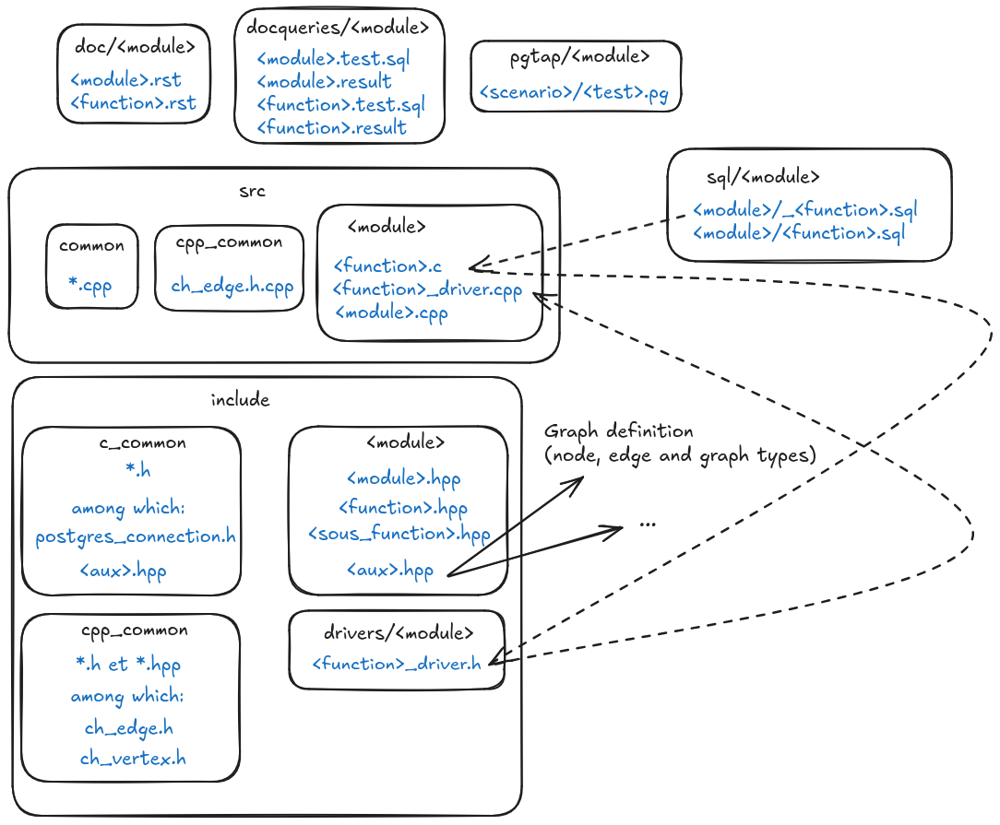

# To add a new algorithm in PgRouting

## Installation (Debian / Ubuntu)

Requirements for `cmake` :
```shell
sudo apt update
sudo apt install build-essential
sudo apt install libboost-graph-dev
sudo apt install postgresql-server-dev-<version>
sudo apt install sphinx
```

Install `cmake` and `g++` :
```shell
sudo apt install cmake
sudo apt install g++
```

Install graphviz (for the documentation)
```shell
sudo apt install graphviz
```


### Simple installation

Compile :
```shell
mkdir build
cd build
cmake -DWITH_DOC=ON ..
make
sudo make install
```

Install `pgrouting` extension :
```sql
dropdb --if-exists -h localhost -U postgres -p 5432 tests_pgrouting
createdb -h localhost -U postgres -p 5432 tests_pgrouting
psql -h localhost -U postgres -p 5432 -d tests_pgrouting 
> CREATE EXTENSION pgrouting CASCADE;
> SELECT pgr_version();
```


### Installation and tests running

There are two types of tests: the ones driven by `pgtap` and the ones made for the documentation.

First, install `pgtap`:
```shell
sudo apt install pgtap
sudo apt install postgresql-<version>-pgtap
```

Then, export the environment variables corresponding to your PostgreSQL connection:
```shell
export PGUSER="postgres"
export PGPASSWORD="postgres"
export PGHOST="localhost"
```
It will avoid that you have to type your password before the database creation and dropping operations. These variables are only valid for the session. To make them persistant, you must put them in the `.bashrc` file.

If your PostgreSQL client as a locale which is not english, you may need to add this environment variable:
```shell
export LC_ALL=C
```
(useful for docqueries tests, since the line `(xx rows)` can otherwise be returned in another language, for example `(xx lignes)`).

Copy the test script `tools/developer/run.sh` and update inside your PostgreSQL version:

```shell
cp tools/developer/run.sh ./build
cp tools/developer/taptest.sh .
bash build/run.sh
```

In case the PG version you are using is not the same as the one you want to use to compile PgRouting, you have to add this option to the `cmake` command, in the `run.sh` script:

```shell
-DPOSTGRESQL_PG_CONFIG="/usr/lib/postgresql/16/bin/pg_config"
```

## Contribution

### How are modules structured?

A PgRouting function is part of a module. 

We illustrate here how a module can be organised, based on an example, which is the module `contraction`. It may of course differ in other modules, but gives guidelines to create a new one if needed. 

In this example, we want to add inside the module `contraction` two functions:
- one to build a hierarchy contracted graph;
- one to apply a bidirectional Dijkstra shortest path algorithm.

Creating the first function will actually consist in adding a parameter to the existing `pgr_contraction` function, for which there are two already implemented contraction methods:
- dead-ends contraction (value 1);
- linear contraction (value 2).
We will add a third method, corresponding to contraction hierarchies.

Creating the second function will consist in creating a new set of files:
1. `src/<module>/<function>.c` which contains:
	- a `_<function>` method, having the same parameters as the SQL function (`PG_FUNCTION_ARGS`), that converts entries and exits between SQL and C and calls the `process` function.
		- This function should not have any capital letters in its name.
	- a `process` method, that calls a `do_<function>` C++ function, declared in the `include/drivers/<module>/<function>_driver.h` file and implemented in the `src/<module>/<function>_driver.cpp`;

2. `src/<module>/<function>_driver.cpp` which contains:
	- a `pgr_<function>` method;
	- a `do_<function>` method;
This file can reference one or several `.hpp` files of the `include/<module>` folder. These files can contain additional functions, associated to their `.cpp` file in the `src/<module>` folder.

3. a `sql/<module>/_<function>.sql` and a `sql/<module>/<function>.sql` file;

4. a `drivers/<module>/<function>_driver.h` file.

This process is illustrated in the following image.




### How is documentation structured?

The documentation must be built with `sphinx`, following these guidelines:
- in the `docqueries/<module>` folder:
	- add `.pg` files with numbered queries inside;
	- add `.result` files with the expected results of these queries;
	- add a `test.conf` perl file containing the sphinx configuration to build `.queries` files;
	- add a `CMakeLists.txt` file containing the building plan of the `.queries` files.
As mentioned in each `CMakeLists.txt` file of each module, each pair of `.pg` / `.result` files will result in the building of a `.queries` file, which will be stored in the `build/doc` folder.

- in the `doc/<module>` folder:
	- add as many `.rst` files as `.pg` files in the `docqueries/<module>` folder;
	- add a `CMakeLists.txt` file containing the building plan of the documentation page;
	- add your images used in the page in a `images` folder.
Images that are shared with other modules documentation can be stored in the `doc/images` folder. Make reference to images and queries in the main `.rst` files.

At the end, you can build the documentation, by uncommenting the corresponding lines in the `build/run.sh` file.

Then you can open the `.html` files generated in the `build/doc/html` folder, for each module.

### How should your Pull Requests be structured?

A Pull Request (PR) corresponding to a new functionnality has about 6 or 7 commits, one by directory:
- `src`;
- `include`;
- `sql`;
- `pgtap`;
- `doc` ;
- `docqueries`;
- `tools`.

### Which tools should you apply to your code before submitting it to the review?

#### Linter
You should first use `cpplinter` to lint your code. 

#### Update signatures

```shell
bash tools/release-scripts/get_signatures.sh 
```

#### Update news

Update file `doc/src/release_notes.rst` with information about your modifications. 

Then execute the following `perl` script:

```shell
perl tools/release-scripts/notes2news.pl
```

#### Develop minimum tests

Your tests must pass with the upcoming version, but also with older ones. To do so, add a condition in PgTap tests to avoid their execution with older versions.


#### Global advice

At the beginning, try to modify a limited number of files and to have your own files for your contribution. Avoid to modify the existing files, except for some code factorization if needed. After the first review, you will be able to modify more files.
